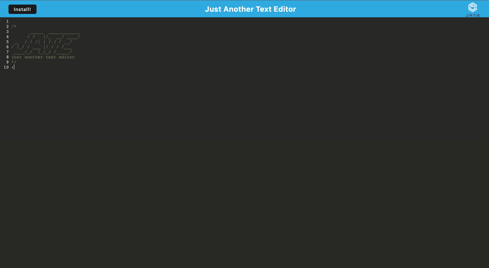

# Text-Editor
Repository for UWCB week 19 challenge - Progressive Web Applications: Text Editor

## Description
For the week 19 challenge I created a text editor PWA using javascript, node.js, express.js and webpack

## Installation
[J.A.T.E.](https://morning-meadow-97303.herokuapp.com/)

Click the above link to use the deployed application on Heroku. If you would like to install the application to be used offline you can click the 'install' button on the top left corner of the page

## Usage
This application is just another text editor. As a PWA it can function both online and offline so feel free to type whatever you'd like and the application will keep all your text saved for your next use.

## Credits
Application created by Gene Kim

Email: [genedanielkim@gmail.com](mailto:genedanielkim@gmail.com)

## License
N/A
